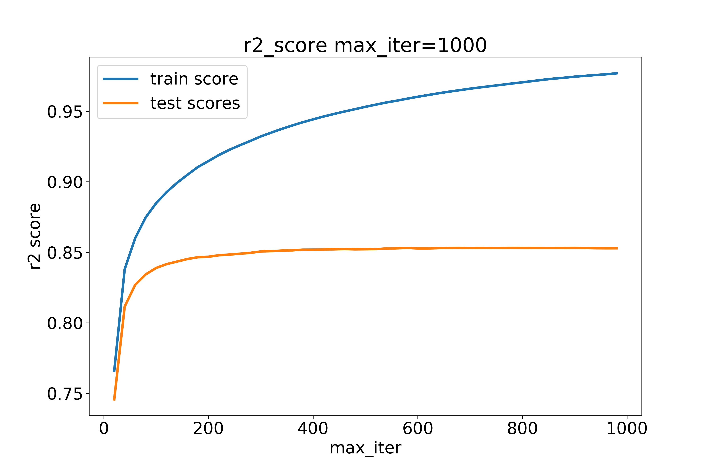
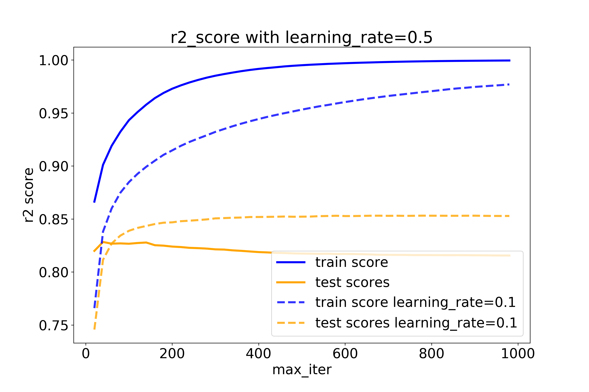
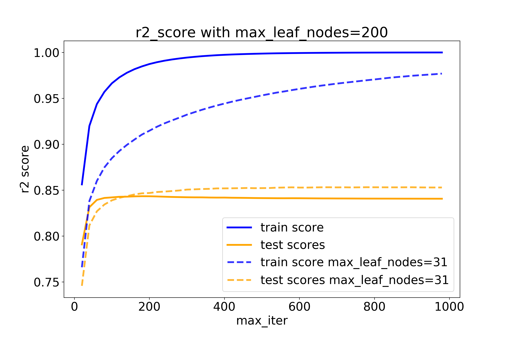
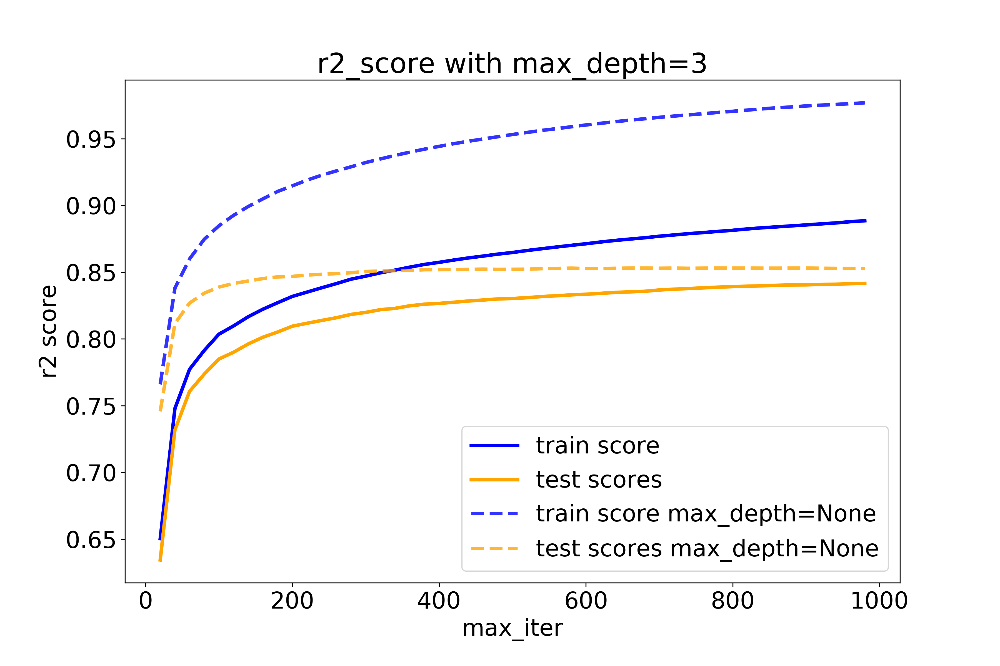
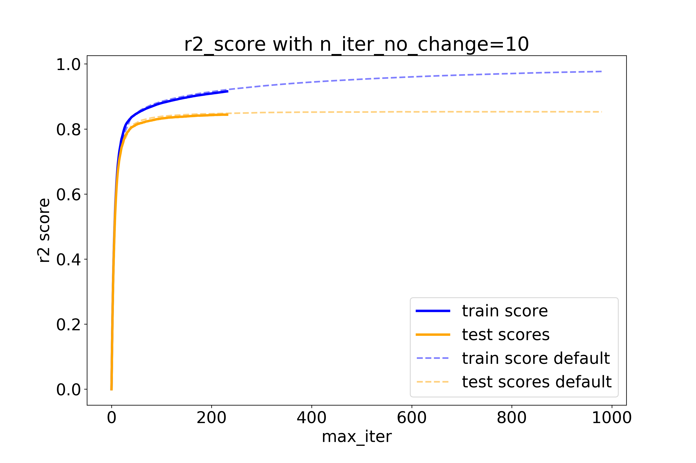

slide-dividers: #
slidenumbers: true

# Deep Dive into scikit-learn's **HistGradientBoosting** Classifier and Regressor
[.header: alignment(center), text-scale(1.7)]
[.text: alignment(left), text-scale(1)]
[.slidenumbers: false]

Thomas J Fan
Scikit-learn Core Developer

# Scikit-learn API 🛠

```py
from sklearn.experimental import enable_hist_gradient_boosting
from sklearn.ensemble import HistGradientBoostingClassifier

clf = HistGradientBoostingClassifier()

clf.fit(X, y)

clf.predict(X)
```

# Supervised learning 📖

$$
y = f(X)
$$

- X of shape `(n_samples, n_features)`
- y of shape `(n_samples,)`

# HistGradient**Boosting**
[.header: alignment(center)]

# Boosting 🏂

$$
f(X) = h_0(X) + h_1(X) + h_2(X) + ...
$$

$$
f(X) = \sum_i h_i(X)
$$

# Hist**Gradient**Boosting
[.header: alignment(center)]

# Gradient 🏔 (Loss Function)

- **Regression**
    1. `least_squares`
    1. `least_absolute_deviation`

- **Classificaiton**
    1. `binary_crossentropy`
    1. `categorical_crossentropy`

# Gradient 🏔 (Regression Loss Function)

- `least_squares`

$$
L(y, f(X)) = \frac{1}{2}||y - f(X)||^2
$$

# Gradient 🏔 - `least_squares`

- **Gradient**

$$
\nabla L(y, f(X)) = -(y - f(X))
$$

- **Hessian**

$$
\nabla^2 L(y, f(X)) = 1
$$

# Gradient Boosting 🏂

- Initial Condition

$$
f_0(X) = C
$$

- Recursive Condition

$$
f_{m+1}(X) = f_{m}(X) - \eta \nabla L(y, f_{m}(X))
$$

where $$\eta$$ is the learning rate

# Gradient Boosting 🏂 - `least_squares`

$$
f_{m+1}(X) = f_{m}(X) + \eta(y - f_{m}(X))
$$

- Let $$h_{m}(X)=(y - f_{m}(X))$$

$$
f_{m+1}(X) = f_{m}(X) + \eta h_{m}(X)
$$

- We need to learn $$h_{m}(X)$$!
- For the next example, let $$\eta=1$$

# Gradient Boosting 🏂 (Example, part 1)

$$
f_0(X) = C
$$

| $$X$$ | $$y$$ | $$f_0(X)$$ | $$y - f_0(X)$$ | $$h_0(X)$$ |
| --- | --- | --- | --- | --- |
| 35 | 70 | 78 | -8 | -7 |
| 45 | 90 | 78 | 12 | 10 |
| 25 | 80 | 78 | 2 | 5 |
| 15 | 50 | 78 | -28 | -20 |
| 55 | 100 | 78 | 22 | 25 |

# Gradient Boosting 🏂 (Example, part 2)

$$
f_{m+1}(X) = f_{m}(X) + h_{m}(X)
$$

| $$f_0(X)$$ | $$h_0(X)$$ | $$f_1(X)$$ | $$y - f_1(X)$$ | $$h_1(X)$$ | $$f_2(X)$$ |
| --- | --- | --- | --- | --- | --- |
| 78 | -7 | 71 | -1 | -1 | 70 |
| 78 | 10 | 88 | 2 | 1 | 89 |
| 78 | 5 | 83 | -3 | -4 | 79 |
| 78 | -20 | 58 | -8 | -6 | 52 |
| 78 | 25 | 103 | -3 | -2 | 101 |

# Gradient Boosting 🏂 (Example, part 3)

With two iterations in boosting:

$$
f(X) = C + h_0(X) + h_1(X)
$$

- **predict**: With X = 40

$$
f(40) = 78 + h_0(40) + h_1(40)
$$

# How to learn $$h_m(X)$$?

[.header: alignment(center), text-scale(2)]
[.text: alignment(center), text-scale(2)]
🌲!

# Tree Growing 🌲 (part 1)


1. For every feature
    1. Sort feature
    1. For every split point
        1. Evaluate split
1. Pick **best** split

# Tree Growing 🌲 (part 2)

- Recall Loss, Gradient, Hessian

$$
L(y, f(X)) = \frac{1}{2}||y - f(X)||^2
$$

$$
G = \nabla L(y, f(X)) = -(y - f(X))
$$

$$
H = \nabla^2 L(y, f(X)) = 1
$$

# Tree Growing 🌲 (part 3)

- How to evaluate split?

$$
Gain = \dfrac{1}{2}\left[\dfrac{G_L^2}{H_L+\lambda}
+ \dfrac{G_R^2}{H_R + \lambda} - \dfrac{(G_L+G_R)^2}{H_L+H_R+\lambda}\right]
$$

- $$\lambda$$: `l2_regularization=0`

# Tree Growing 🌲 (part 4)


1. For every feature
    1. Sort feature
    1. For every split point
        1. Evaluate split
1. Pick **best** split

- Done?

# Tree Growing 🌲 (part 5)


1. For every feature
    1. Sort feature - _**O(nlog(n))**_
    1. For every split point - _**O(n)**_
        1. Evaluate split
1. Pick **best** split

# **Hist**GradientBoosting
[.header: alignment(center)]

# Binning! 🗑 (part 1)


# Binning! 🗑 (part 2)

```py
# Original data
[-0.752,  2.7042,  1.3919,  0.5091, -2.0636,
 -2.064, -2.6514,  2.1977,  0.6007,  1.2487, ...]

# Binned data
[4, 9, 7, 6, 2, 1, 0, 8, 6, 7, ...]
```

# Histograms! 📊 (part 1)


# Histograms! 📊 (part 2)

1. For every feature
    1. Build histogram _**O(n)**_
    1. For every split point - _**O(n\_bins)**_
        1. Evaluate split
1. Pick **best** split


# Histograms! 📊 (part 3)


# Trees = $$h_{m}(X)$$ 🌲

$$
f(X) = C + \eta\sum h_{m}(X)
$$

# Overview of Algorithm 👀

1. Bin data
1. Make initial predictions (constant)
1. Calculate gradients and hessians
1. Grow Trees For Boosting
    1. Find best splits
    1. Add tree to predictors
    1. Update gradients and hessians

# Implementation? 🤔

- Pure Python?
- Numpy?
- Cython?
- Cython + OpenMP!

# OpenMP! (Bin data 🗑, part 1)

1. _**Bin data**_
1. Make initial predictions (constant)
1. Calculate gradients and hessians
1. Grow Trees For Boosting
    1. Find best splits by building histograms
    1. Add tree to predictors
    1. Update gradients and hessians

# OpenMP! (Bin data 🗑, part 2)

[.code-highlight: 1]

```py
for i in range(data.shape[0]):
    left, right = 0, binning_thresholds.shape[0]
    while left < right:
        middle = (right + left - 1) // 2
        if data[i] <= binning_thresholds[middle]:
            right = middle
        else:
            left = middle + 1
    binned[i] = left
```

# OpenMP! (Bin data 🗑, part 3)

[.code-highlight: 1-4]

```py
# sklearn/ensemble/_hist_gradient_boosting/_binning.pyx
for i in prange(data.shape[0],
                schedule='static',
                nogil=True):
    left, right = 0, binning_thresholds.shape[0]
    while left < right:
        middle = (right + left - 1) // 2
        if data[i] <= binning_thresholds[middle]:
            right = middle
        else:
            left = middle + 1
    binned[i] = left
```

# OpenMP! (building histograms 🌋, part 1)

1. Bin data
1. Make initial predictions (constant)
1. Calculate gradients and hessians
1. Grow Trees For Boosting
    1. Find best splits by _**building histograms**_
    1. Add tree to predictors
    1. Update gradients and hessians

# OpenMP! (building histograms 🌋, part 2)

[.code-highlight: all]
[.code-highlight: 1-4]
[.code-highlight: 6-8]

```py
# sklearn/ensemble/_hist_gradient_boosting/histogram.pyx
with nogil:
    for feature_idx in prange(n_features, schedule='static'):
        self._compute_histogram_brute_single_feature(...)

for feature_idx in prange(n_features, schedule='static',
                          nogil=True):
    _subtract_histograms(feature_idx, ...)
```

# OpenMP! (Find best splits ✂️, part 1)

1. Bin data
1. Make initial predictions (constant)
1. Calculate gradients and hessians
1. Grow Trees For Boosting
    1. _**Find best splits**_ by building histograms
    1. Add tree to predictors
    1. Update gradients and hessians

# OpenMP! (Find best splits ✂️, part 2)

```py
# sklearn/ensemble/_hist_gradient_boosting/splitting.pyx
for feature_idx in prange(n_features, schedule='static'):
    # For each feature, find best bin to split on
```

# OpenMP! (Splitting ✂️, part 3)

```py
# sklearn/ensemble/_hist_gradient_boosting/splitting.pyx
for thread_idx in prange(n_threads, schedule='static',
                         chunksize=1):
    # splits a partition of node
```

# OpenMP! (Update gradients and hessians 🏔, part 1)

1. Bin data
1. Make initial predictions (constant)
1. Calculate gradients and hessians
1. Grow Trees For Boosting
    1. Find best splits by building histograms
    1. Add tree to predictors
    2. _**Update gradients and hessians**_

# OpenMP! (Update gradients and hessians 🏔, part 2)

- `least_squares`

```py
# sklearn/ensemble/_hist_gradient_boosting/_loss.pyx
for i in prange(n_samples, schedule='static', nogil=True):
    gradients[i] = raw_predictions[i] - y_true[i]
```

# Hyperparameters (Bin data 🗑, part 1)

1. _**Bin data**_
1. Make initial predictions (constant)
1. Calculate gradients and hessians
1. Grow Trees For Boosting
    1. Find best splits by building _**histograms**_
    1. Add tree to predictors
    1. Update gradients and hessians

# Hyperparameters (Bin data 🗑, part 2)

- `max_bins=255`


# Hyperparameters (Loss 📉, part 1)

1. Bin data
1. _**Make initial predictions (constant)**_
1. Calculate _**gradients and hessians**_
1. Grow Trees For Boosting
    1. Find best splits by building histograms
    1. Add tree to predictors
    2. _**Update gradients and hessians**_

# Hyperparameters (Loss 📉, part 2)

- `HistGradientBoostingRegressor`
    1. `loss=least_squares` (default)
    1. `least_absolute_deviation`

- `HistGradientBoostingClassifier`
    1. `loss=auto` (default)
    1. `binary_crossentropy`
    1. `categorical_crossentropy`

- `l2_regularization=0`

# Hyperparameters (Boosting 🏂, part 1)

1. Bin data
1. Make initial predictions (constant)
1. Calculate gradients and hessians
1. Grow Trees For _**Boosting**_
    1. Find best splits by building histograms
    1. Add tree to predictors
    1. Update gradients and hessians

# Hyperparameters (Boosting 🏂, part 2)

- `learning_rate=0.1` ($$\eta$$)
- `max_iter=100`

$$
f(X) = C + \eta\sum_{m}^{max\_iter}h_{m}(X)
$$

# Hyperparameters (Boosting 🏂, part 3)



# Hyperparameters (Boosting 🏂, part 4)



# Hyperparameters (Grow Trees 🎄, part 1)

1. Bin data
1. Make initial predictions (constant)
1. Calculate gradients and hessians
1. _**Grow Trees**_ For Boosting
    1. Find best splits by building histograms
    1. Add tree to predictors
    1. Update gradients and hessians

# Hyperparameters (Grow Trees 🎄, part 2)

- `max_leaf_nodes=31`
- `max_depth=None`
- `min_samples_leaf=20`

# Hyperparameters (Grow Trees 🎄, part 3)



# Hyperparameters (Grow Trees 🎄, part 4)



# Hyperparameters (Early Stopping 🛑, part 1)

1. Bin data
1. _**Split into a validation dataset**_
1. Make initial predictions (constant)
1. Calculate gradients and hessians
1. Grow Trees For Boosting
    1. ...
    1. _**Stop if early stop condition is true**_

# Hyperparameters (Early Stopping 🛑, part 2)

- `scoring=None` (could be 'loss')
- `validation_fraction=0.1`
- `n_iter_no_change=None`
- `tol=1e-7`

# Hyperparameters (Early Stopping 🛑, part 3)



# Hyperparameters (Misc 🎁)

- `verbose=0`
- `random_state=None`

# Benchmarks 🚀 (HIGGS Part 1)

- 8800000 records
- 28 features
- binary classification  (1 for signal, 0 for background)

# Benchmarks 🚀 (HIGGS Part 2)

- `max_iter=100`, `learning_rate=0.1`, `export OMP_NUM_THREADS=12` (AMD 3900x)

| library  | time | roc auc | accuracy |
|----------|------|---------|----------|
| sklearn  | 38s  | 0.8125  | 0.7324   |
| lightgbm | 39s  | 0.8124  | 0.7322   |
| xgboost  | 48s  | 0.8126  | 0.7326   |
| catboost | 100s | 0.8004  | 0.7222   |

# Benchmarks 🚀 (HIGGS Part 3)

- `max_iter=500`

| library  | time | roc auc | accuracy |
|----------|------|---------|----------|
| sklearn  | 129s | 0.8281  | 0.7461   |
| lightgbm | 125s | 0.8283  | 0.7462   |
| xgboost  | 149s | 0.8285  | 0.7465   |
| catboost | 427s | 0.8225  | 0.7412   |


# Benchmarks 🚀 (HIGGS Part 4)

`export OMP_NUM_THREADS=4` `max_iter=100` (on my laptop)

| library  | time (12 cores) | time (4 cores) |
|----------|------|---------|
| sklearn  | 38s  | 85s |
| lightgbm | 39s  | 86s |
| xgboost  | 48s  | 115s |
| catboost | 100s | 164s |

# Benchmarks 🚀 (HIGGS Part 5)

[.header: alignment(center), text-scale(1.8)]
[.text: alignment(center), text-scale(1.8)]
DEMO!

# Roadmap 🛣 (In upcoming 0.22)

- ~~Missing Values~~

```py
from sklearn.experimental import enable_hist_gradient_boosting
from sklearn.ensemble import HistGradientBoostingClassifier
from sklearn.datasets import make_classification

X, y = make_classification(random_state=42)
X[:10, 0] = np.nan

gbdt = HistGradientBoostingClassifier().fit(X, y)
print(gbdt.predict(X[:20]))
# [0 0 1 1 0 0 0 1 0 1 1 0 0 0 1 1 1 0 0 1]
```

# Roadmap 🛣 (After 0.22)

- Discrete (Categorical) Feature support
- Sparse Data
- Sample Weights

# Conclusion 🎉

```py
from sklearn.experimental import enable_hist_gradient_boosting

from sklearn.ensemble import HistGradientBoostingClassifier
from sklearn.ensemble import HistGradientBoostingRegressor
```

- Try out the dev build (for missing values):

```bash
pip install --pre -f \
https://sklearn-nightly.scdn8.secure.raxcdn.com scikit-learn
```

- [github.com/thomasjpfan/pydata-2019-histgradientboosting](https://github.com/thomasjpfan/pydata-2019-histgradientboosting)
